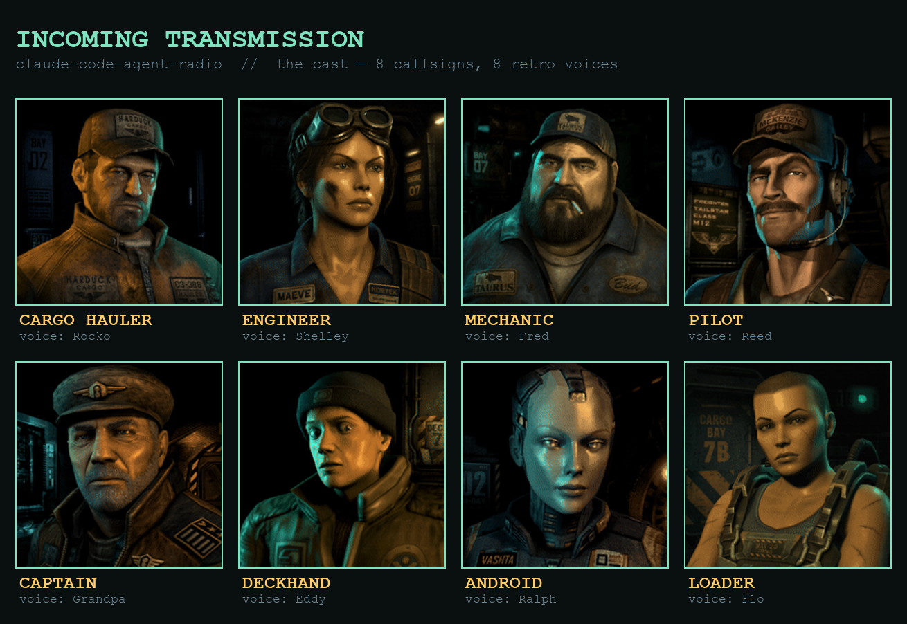
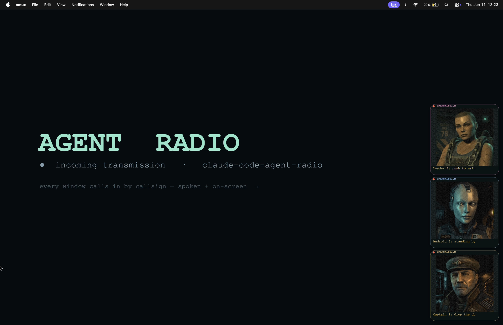

# claude-code-agent-radio

RTS-style "incoming transmission" notifications for [Claude Code](https://claude.com/claude-code) (and any agent that fires hooks). When an agent needs you — a permission prompt, or it's gone idle waiting — it **speaks a short line of radio chatter** via macOS `say` and shows a small **retro portrait card** in the corner of the screen. Each window gets its own **callsign** so you can tell, by ear and at a glance, *which* of your agents is calling.

Think StarCraft unit callouts meets ATC radio discipline, for a desk full of parallel coding agents.


> ▶ **[Watch the demo with sound (docs/demo.mp4)](docs/demo.mp4)** — four windows calling in, each with its own callsign, portrait, and voice.



## Why

If you run several Claude Code windows at once, you lose track of which one is blocked on you. A single system beep doesn't say *who* or *why*. agent-radio gives every window a named voice + face and only speaks when you're actually needed — and never over the window you're already looking at.

## What you get

- **Spoken radio chatter**, routed by event: a *warning* tone for dangerous/mutating-tool permission ("danger close, weapons free?"), a *clearance* for benign permission, an *idle* sign-off when it hands back to you.
- **Per-window callsign**, derived from the conversation's own title (Claude's `/rename`), with collision numbering ("Central 1", "Central 2") when two windows would clash. Any agent can name itself with `say-callsign.sh "Takeout Watch"`.
- **A floating RTS portrait card** (a persistent, click-through, non-focus-stealing overlay daemon — it never steals your keyboard focus).
- **Focus-aware quiet**: silent for the window you're actively in; audio-only (no card) while you're typing in the terminal; the full card when you're in another app.
- **Rate-limit "fuel gauge"** callouts: JOKER (≥80%) → BINGO (≥95%) → WINCHESTER (≥100%), spoken in gas/fuel metaphors, fired once when you cross a threshold.
- **TTS pronunciation** that spells acronyms and reads CLI flags aloud (`API`→"A P I", `-rf`→"dash r f").
- **A lookdev studio** (`say-notify-devserver.py`) with live sliders to tune the card's look, voices, and timing.

## Requirements

- macOS (uses `say`, `afplay`, AppKit/ScreenCaptureKit via Swift, `lsof`).
- `jq`, `swiftc` (Xcode CLT) — the overlay binaries build on demand.
- Optional: [`cmux`](https://github.com/manaflow-ai/cmux) for per-window focus detection and `/rename`-based callsigns (degrades gracefully without it).

## Install

1. Register the hook in `~/.claude/settings.json` (Notification + Stop events):

   ```json
   {
     "hooks": {
       "Notification": [{ "matcher": "", "hooks": [{ "type": "command", "command": "/abs/path/to/claude-code-agent-radio/say-notify.sh" }] }],
       "Stop":         [{ "matcher": "", "hooks": [{ "type": "command", "command": "/abs/path/to/claude-code-agent-radio/say-notify.sh" }] }]
     }
   }
   ```
   `Stop` is what fires in `--dangerously-skip-permissions` / bypass mode, where permission Notifications never happen.

2. (Optional) run the overlay daemon at login via a LaunchAgent pointing at `say-notify-overlayd`, so its one-time window creation happens at login, never mid-typing.

## Usage

- It just works once the hook is registered — agents call out when they need you.
- `say-callsign.sh "Strike Team"` — name the current window's callsign (keyed by `$CLAUDE_CODE_SESSION_ID`). Renaming the chat in Claude afterwards (`/rename`) **supersedes** it — the most recent naming action wins: `say-callsign.sh` records the chat title at set-time and steps aside once you rename past it. `say-callsign.sh --reset` clears the override entirely (back to the chat title / project name).
- `say-addressee.sh "Boss"` — set how the radio **addresses you** (replaces the default "Godfather"). `say-addressee.sh --auto` pulls a name you're already known by (`git config user.name`, else `$USER`); `--reset` restores "Godfather". Per-call override: `SAY_ADDRESSEE="Overlord"`.
- `python3 say-notify-devserver.py` — open the lookdev studio to tune the look/voices, then fire test transmissions.

### Env knobs

`SAY_ADDRESSEE` (how it calls you) · `SAY_OVERLAY=0` (audio only) · `SAY_FORCE=1` (bypass focus suppression) · `SAY_MODE=quotes` (movie-quote flavor) · `SAY_RATE` · `SAY_VOICE` · `SAY_PORTRAIT` · `SN_TEAL`/`SN_AMBER`/`SN_W`/`SN_IMG`/`SN_CORNER`/`SN_LEVEL` (card look) · `SAY_BEEPGAP`/`SAY_MSGGAP` (audio timing) · `SAY_LOG=1` (debug log).

## How it works

`say-notify.sh` reads the hook JSON on stdin, derives the callsign, picks a routed line, normalizes it for TTS, and (a) drops a card-request file for the daemon and (b) speaks — serialized so agents never talk over each other. `say-notify-overlayd` is one long-lived borderless non-activating window; each transmission is a faded-in subview, so no window is ever created/ordered per alert and your terminal focus is never disturbed.



## The cast — how the portraits were made

The eight characters (`portraits/st*.gif`) are deliberately **late-90s / PS1-era pre-rendered** — plasticky skin, low-poly read, baked CRT grain — so they're legible as tiny corner chips and don't read as generic "AI art."

- **Stills:** generated with **OpenAI `gpt-image-2`** (via [fal](https://fal.ai)), prompted for *90s pre-rendered CG / PS1 character-select portrait* with a transparent-background pass. `gpt-image-2` was chosen over FLUX specifically because FLUX kept producing modern photoreal skin no matter the prompt — it couldn't hit the retro-render look, where the OpenAI model could.
- **Animation:** each still was driven to a short seamless loop with **Luma Ray 3.2** (image-to-video, `loop=true`) — chosen because it **preserves the source art style** instead of re-rendering it (idle breathing / subtle head motion, not a restyle).
- **Voices:** each portrait is paired 1:1 with a matching macOS retro `say` voice (Grandpa, Ralph, Fred, Reed, Rocko, Shelley, Eddy, Flo) by timbre — see the cast image above. The pairing lives in `portraits/voices.tsv` (`basename<TAB>voice`); an unmapped portrait falls back to Grandpa.

Re-generating or restyling the cast is done through `say-notify-devserver.py` (the lookdev studio) plus the fal image/video endpoints. To swap in a new cast: drop the `portraits/*.gif` in and add their voice rows to `portraits/voices.tsv` — that's all the runtime needs.

## Development

The overlay binaries (`say-notify-overlay`, `say-notify-overlayd`) build on demand from their `.swift` sources — `say-notify.sh` rebuilds them when the binary is older than the source. After editing `say-notify-overlayd.swift`, the **next notification rebuilds the binary and restarts the running daemon for you** (it stops the old instance and, if a LaunchAgent supervises it, brings the new one up under launchd — converging to exactly one instance). The one-time focus blip from the relaunch only ever happens on your own dev edits, never on a normal alert. To restart by hand without waiting for a notification:

```bash
swiftc -O say-notify-overlayd.swift -o say-notify-overlayd
launchctl kickstart -k "gui/$(id -u)/com.conner.say-notify-overlayd"   # if under a LaunchAgent
# otherwise: pkill -f say-notify-overlayd   (relaunches on the next notification)
```

Copying the binary around can leave its mtime newer than the source, which suppresses the auto-rebuild (and so the auto-restart) — force a rebuild if a running card looks stale (e.g. wrong corner).

## License

MIT — see [LICENSE](LICENSE).
