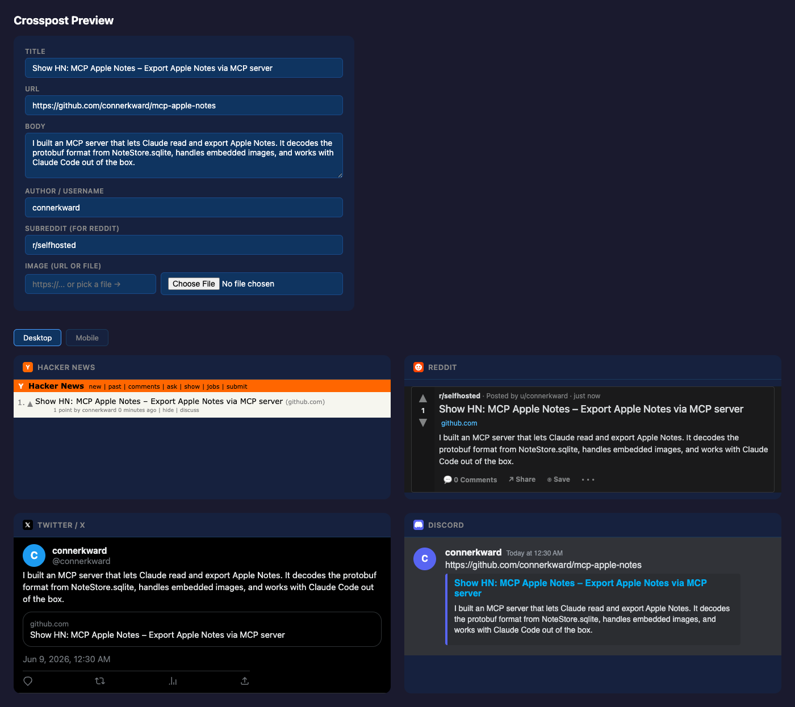
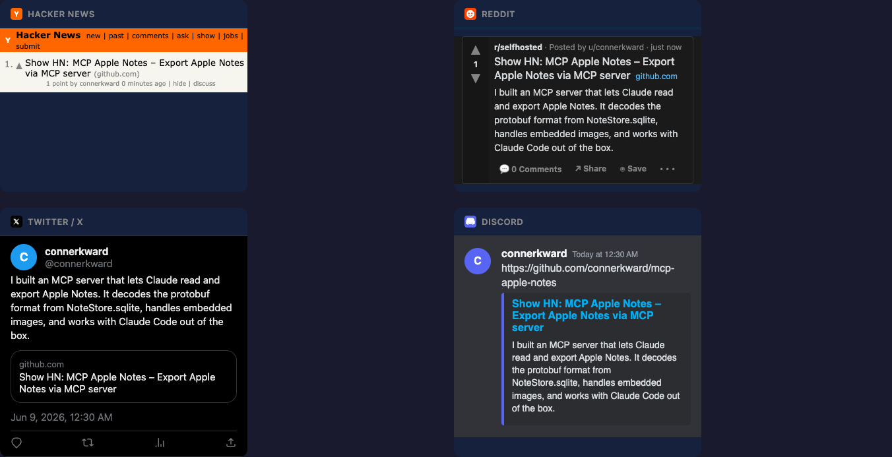

# Crosspost

A cross-posting harness for [Claude Code](https://claude.com/claude-code). One piece of content — an announcement, a "Show HN", a release — posted to many platforms, each formatted to that platform's rules, without leaving the terminal.

There is no app to run and no service to deploy. Crosspost is a folder of platform docs: each file in [`platforms/`](platforms/) tells Claude how to post to one destination — its auth, its API, its character limits, and the exact steps to submit. You say what to post and where; Claude reads the relevant docs, rewrites the content per platform, and executes.

## About

Announcing a project means rewriting the same blurb five times: an 80-char neutral title for Hacker News, a subreddit-appropriate self-post for Reddit, a 280-char punchy version with hashtags for Twitter, a rich embed for Discord, a formal version for LinkedIn — plus pinging registries like Glama or mcp.so. Each has different auth, different format constraints, and different etiquette.

Crosspost turns that into a single instruction. The knowledge lives as markdown, not code, so adding a platform is writing a doc — not shipping a new adapter — and Claude already knows how to follow markdown instructions and call the APIs.

**Design:**

- **Docs, not code.** Each platform is a markdown file. No build step, no dependencies, no adapter classes to maintain.
- **Per-platform formatting.** HN gets a factual title; Twitter gets the 280-char hook; Discord gets an embed. The content is reshaped to fit, not copy-pasted.
- **Secrets stay in `.env`.** Platform docs name the env vars they need (`HN_USERNAME`, `REDDIT_CLIENT_ID`, `TWITTER_API_KEY`, `DISCORD_WEBHOOK_URL`, …); the values live in a git-ignored `.env`, never in the docs or in commits.
- **Visual preview.** [`preview.html`](preview.html) renders your title/URL/body as live, native-looking mockups for each platform before you post.

## Usage

Tell Claude Code what to post and where:

- "Post this to HN and Reddit"
- "Announce mcp-apple-notes on Glama, mcp.so, Twitter, and Discord"
- "Cross-post everywhere"

Claude reads the relevant platform docs from `platforms/`, formats the content appropriately for each, and submits.

## Preview

Open [`preview.html`](preview.html) in a browser. Type a title, URL, and body once and see how the post will look on every platform — Hacker News, Reddit, Twitter/X, and Discord — rendered as native-looking cards. Toggle between desktop and mobile layouts.

The same content, reshaped per platform:

## Platforms

| Platform | Type | Auth | Notes |
|----------|------|------|-------|
| [Hacker News](platforms/hackernews.md) | Link / text post | Cookie session (`HN_USERNAME`/`HN_PASSWORD`) | "Show HN:" prefix, ~80-char neutral title |
| [Reddit](platforms/reddit.md) | Link / self / cross-post | OAuth password grant (grandfathered creds only) | Self-service API closed Nov 2025 (Responsible Builder Policy); new apps need approval |
| [Twitter / X](platforms/twitter.md) | Tweet / thread | Browser (Chrome); API needs paid credits | 280 chars; new API accounts are pay-per-use |
| [Discord](platforms/discord.md) | Webhook message / embed | Webhook URL | Rich embeds, up to 2000 chars |
| [LinkedIn](platforms/linkedin.md) | Text / article share | OAuth 2.0 (`w_member_social`) | 3000 chars, professional tone |
| [Smithery](platforms/smithery.md) | MCP registry | `@smithery/cli` publish | Largest MCP registry; `smithery.yaml` in repo |
| [Official MCP Registry](platforms/mcp-registry-official.md) | MCP registry | `mcp-publisher` CLI (GitHub OAuth) | Canonical `registry.modelcontextprotocol.io`; `server.json` |
| [PulseMCP](platforms/pulsemcp.md) | MCP directory | Ingests official registry / submit form | Read-only aggregator; no API |
| [Glama](platforms/mcp-glama.md) | MCP registry | GitHub URL submission | Indexes MCP servers from GitHub |
| [mcp.so](platforms/mcp-so.md) | MCP directory | GitHub URL submission | MCP server directory |
| [Cline Marketplace](platforms/cline-mcp-marketplace.md) | MCP marketplace (in-editor) | GitHub issue submission | Needs 400×400 PNG logo + install README |
| [awesome-mcp-servers](platforms/awesome-mcp-servers.md) | Curated GitHub list | Fork → PR | `punkpeye/awesome-mcp-servers`; alphabetical entry |
| [mcp-get](platforms/mcp-get.md) | MCP registry (deprecated) | — | Abandoned; points to Smithery |
| [ComfyUI Registry](platforms/comfyui-registry.md) | Package publish | `comfy-cli` | For ComfyUI custom nodes only |

## Posting methods

Two ways content goes out, per platform:

- **API / webhook** — headless, scriptable, automatable (cron). Used where a free,
  usable API exists: Discord (webhook), Bluesky (app password), LinkedIn (token),
  the MCP registries.
- **Browser ([browser-posting.md](browser-posting.md))** — semi-manual: Claude fills the
  web composer in your **real logged-in browser**, you approve and click submit. No
  stored secrets. The right path where there's no usable API (HN), the API is
  paywalled (X is pay-per-use), or you'd rather not store credentials.

Reddit is neither: its self-service API closed in Nov 2025 (Responsible Builder
Policy) and `reddit.com` is blocked in the browser tool — so Reddit is **manual**.

## Adding a platform

Add a markdown file to [`platforms/`](platforms/) with:

- **Auth** — method and required env vars / secrets
- **API or submission method** — REST API, form POST, CLI tool, webhook, etc.
- **Content format constraints** — char limits, markdown support, media handling
- **Step-by-step posting instructions** Claude can follow

That's it — no code to register, no adapter to wire up. The next time you ask Claude to "cross-post," the new platform is available.
