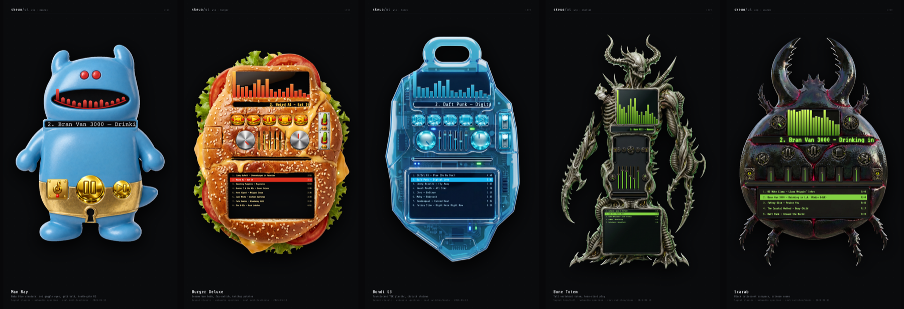

# skeuo-ui

Prompt-driven skeuomorphic UI. **One layout template → many AI-styled skins**, composited into a real, working React media player where the chrome is generated art and the live content (clock, spectrum, marquee, playlist) is dynamic.

Six skins ship — deliberately spread across material families to prove variance, not recolors: **Winamp Classic** (gunmetal/chrome), **Fallout Pip-Boy** (riveted olive CRT), **Baldur's Gate** (carved stone + gold filigree), **Mac OS X Aqua** (glossy light glass), **70s Hi-Fi** (walnut + aluminium), **Papercraft** (cut-paper).

Controls span buttons, toggles, **rotary knobs**, horizontal/vertical sliders, **segmented selectors**, an **XY pad**, a click/double-click playlist, and a drag-to-move title bar. The template also carves out **non-interactive flourish regions** (corners, side rails, header crest, nameplate) that the model fills with skin-specific ornament — and a transparent-background generation pass lets each skin keep its own silhouette.



## The idea

The hard part of "AI-skinned UI" is **consistency** — making generated art line up with real, interactive widgets, and keeping the right things baked vs. the right things live. This repo solves that with a single source of truth:

```
                    src/template/  (ONE template: every region's
                     rect + kind + content-type + layer)
                              │
            ┌─────────────────┴──────────────────┐
            ▼                                     ▼
  generation/render_control.py            src/player/Composite.tsx
  renders a neutral skeuomorphic          reads the SAME template and
  BLUEPRINT (control.png) showing         lays widgets at identical coords
  exactly where each control sits                 │
            │                              • frame.png   → styled background
            ▼                              • sprite regions → interactive
  generation/generate.py                     overlays (press feedback)
  fal gpt-image-1.5/edit restyles         • dynamic regions → live React
  the blueprint per skin, in place,         (clock, spectrum, marquee,
  keeping screens empty + channels           playlist) over blank screens
  knob-free  →  public/skins/<id>/frame.png
```

Because the blueprint handed to the model and the runtime compositor both read the **same normalized coordinates**, generated art and live widgets align *by construction* — no per-skin hand-tuning. Toggle the **Wireframe** checkbox in the app to see the template the model is styling from (color-coded by kind; dashed = dynamic, solid = baked sprite).

### Sprite vs. dynamic — the split that makes it work

Every region in the template declares `content: "sprite" | "dynamic" | "decoration"`:

- **sprite** — baked into `frame.png` (buttons, knobs, slider channels, segmented bars, bezel, screen wells). React renders only a transparent hit-target + the moving/active part (thumb, knob indicator, segment highlight).
- **dynamic** — the art leaves this area as empty glass; React renders live content into it (elapsed time, spectrum analyzer, scrolling marquee, EQ curve, playlist). Never baked. A per-skin `--screen-scrim` guarantees text contrast when a baked screen lands lighter/darker than the skin's text.
- **decoration** — baked-only ornament (corners, rails, crest, nameplate); no runtime element at all.

## Running

```bash
npm install
npm run dev    # http://localhost:5173/
```

Generated `frame.png` layers are committed under `public/skins/<id>/`, so the app runs offline. The player is fully interactive: transport, shuffle/repeat, EQ sliders, volume/balance, click/double-click playlist rows.

## Regenerating / adding a skin

```bash
python3 generation/render_control.py     # blueprint from the template
python3 generation/generate.py           # styles all skins in parallel via fal
```

`generate.py` reads `FAL_KEY` from `~/dev/central/.env`, uploads the blueprint once, submits one `fal-ai/gpt-image-1.5/edit` job per skin in parallel (transparent background, so each skin keeps its own silhouette), and downloads each result to `public/skins/<id>/frame.png` (~60-70s/skin, ~$0.19 each at `quality: high`). `ONLY=winamp,hifi python3 generation/generate.py` regenerates a subset.

To add a skin: add a prompt to `SKINS` in `generation/generate.py` and an entry to `skinList` in `src/player/skins.ts`. To change the *layout* (move/resize widgets), edit `src/template/winamp-layout.ts` — every skin updates from the one template.

### Why Nano Banana Pro (Gemini 3 Pro Image)

After A/B'ing on the same blueprint, `fal-ai/gemini-3-pro-image-preview/edit` beat gpt-image-1.5/2 and Seedream 4.5: it restyles at native 2K (gpt-image is capped at 1536 and reconstructs through a low-res latent, which smears UI edges), holds the layout tightest, and keeps the EQ channels distinct. It has no transparent-background param, so skins are generated opaque (the device fills the frame). The prompt restyles in place, keeps screens **empty** (so live content shows), and leaves slider channels **knob-free** (the knob is a live React element).

## Reverse direction: freeform → template → reskin

You can also go the other way — generate a player **freeform** and extract a template from it:

```bash
python3 generation/freeform.py          # gpt-image-2 designs a player; OpenAI vision extracts boxes
python3 generation/freeform_reskin.py   # blueprint from the extracted template → reskin via Nano Banana
```

`freeform.py` writes `generation/freeform/`: `donor.png` (the freeform design), `template.json` (extracted, schema-compatible), and `overlay.png` (boxes drawn on the donor for verification). The extracted template becomes the new source of truth, so the reskinned output is internally aligned regardless of extraction precision — the donor just seeds the layout. Vision grounding is approximate (OpenAI `gpt-4o`); a stronger grounding model (Gemini) would tighten the boxes.

### Per-style freeform skins

```bash
python3 generation/freeform_all.py     # one freeform layout PER style, end to end
```

This runs the whole loop six times — each style gets its **own** gpt-image-2 design with a distinct layout (two-dial Hi-Fi, left-button-column Fallout, symmetric Fantasy, …), its own extracted template, and its own Nano Banana reskin. They appear in the app as the `✦ freeform` skins, each rendering live + interactive on a unique layout (a skin's `style` field reuses the base palette CSS while its `templateUrl` carries its own extracted geometry). The compositor fetches a skin's template at runtime when present, falling back to the canonical one.

### Not a rectangle — wild silhouettes

```bash
python3 generation/wild.py winamp winamp-shaped   # let the model design the SHAPE
```

`wild.py` lets gpt-image-2 freely design a **wildly non-rectangular** player (a chrome-creature Winamp with horns and legs, a carved-stone fantasy shield with a gryphon head), on a plain white background. It then cuts the background out with **BiRefNet** (`fal-ai/birefnet/v2`) to a true alpha silhouette and extracts a template so it stays interactive. The compositor renders the frame as a transparent layer with a shape-following drop shadow, so the player on screen is the real irregular outline — not a card. The `✦ shaped` skins demonstrate this.

## Layout

```
src/
  App.tsx                     # skin selector + wireframe toggle + Composite
  template/
    schema.ts                 # Template / Region types (rect, kind, content, layer)
    winamp-layout.ts          # the canonical layout, authored once in px → normalized
  player/
    Composite.tsx             # reads template, positions sprites + live widgets
    usePlayer.ts              # all live player state (the dynamic half)
    Visualizer.tsx            # canvas spectrum analyzer (colors from skin CSS vars)
    data.ts                   # per-skin playlist content + EQ bands
    skins.ts                  # skin registry (which layers exist, baked flag)
  skins/
    player.css                # shared structure (positioning, controls, wireframe)
    winamp/fallout/fantasy/aqua/hifi/papercraft.css  # per-skin CSS (vars + effects)
generation/
  render_control.py           # template → neutral blueprint (control.png)
  generate.py                 # blueprint → styled frame.png per skin via fal
  template.json               # exported template (single source of truth for tooling)
public/skins/{id}/frame.png   # generated styled layers
```

Every skin also has a pure-CSS fallback (used when no `frame.png` is present), so the UI is always aligned and presentable even before generation.

## Tech

- Vite + React + TypeScript
- Python 3 + Pillow (blueprint render)
- fal.ai `fal-ai/gpt-image-1.5/edit` (layout-preserving restyle)
