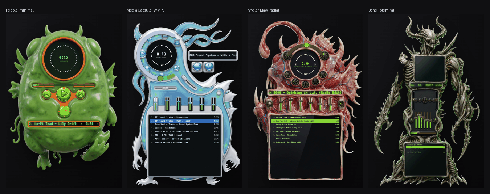

# skeuo-ui

AI-generated skeuomorphic music-player skins with **genuinely working hardware** — flip switches whose levers flip, knobs whose caps turn, faders with real caps — driven by a layered generate→detect→composite pipeline and a WebAudio engine.



**Live demo:** https://skeuo-ui.pages.dev — mobile: swipe left/right to switch skins. Desktop: a sidebar of skins plus **Create skin** (generate a new body from a prompt), **Edit template** (drag/resize the control layout), and **Connect Spotify** (drive real playback through any skin).

## The layered architecture

Three independent layers, composited live by React:

```
layer 1 — BODY (AI image)        → wild_sculpt.py  (the root-cause pipeline)
  Creativity and geometry are split at the right joint so alignment is never
  detected or repaired — it is true BY CONSTRUCTION:
    1. gpt-image-2 designs only a flat SILHOUETTE (an easy, reliable ask; this
       is where the wild shape comes from). The prompt invites tall/narrow,
       squat/wide, asymmetric, angular or organic — not a generic blob.
    2. WE draw the interior deterministically INSIDE that exact mask — screens
       and wells fitted band-by-band to the widest interior span — so every
       coordinate is known and everything fits the shape.
    3. Nano Banana paints the material over the blueprint (layout-preserving).
       Reference-style images (assets/refs/) can ride along as extra image_urls
       to steer palette/material while the blueprint stays layout authority.
    4. The SAME mask becomes the alpha — no BiRefNet, no holes, no guessing.
    5. The template is emitted from the drawn coordinates.
  Layout-FIRST variants (radial/capsule/minimal) invert 1↔2: the arc-native
  template is drawn FIRST and the image model grows the creature AROUND the
  wells (a covers() gate rejects bodies that don't fully contain the layout).

layer 2 — CONTROL SPRITES with STATES (AI image)    → gen_sprites.py, gen_buttons.py
  per style: the SAME flip switch rendered twice in one image (lever down |
  lever up) and split → toggling swaps real art. A cap-only circular knob whose
  art rotates. A fader cap. MOLDED transport faces (gen_buttons.py): one sheet
  of five round buttons in the skin's own material, split by the column-alpha
  PROFILE (valley between buttons) so a play button READS as a play button —
  robust even when organic styles bridge neighbours. gpt-image-1.5, transparent.

layer 3 — LIVE UI (React)
  recessed screens with live content (canvas spectrum fed by the real
  post-EQ AnalyserNode, marquee, clock, playlist), a RADIAL spectrum + center
  clock for round dial screens, a circular SEEK ring (slider-arc), drag/touch
  interaction (Pointer Events), and a generative WebAudio engine: saw-chord pad
  → preamp → 10 peaking EQ bands → tilt → pan → volume → analyser. Volume/EQ/
  balance changes are audible AND visible in the spectrum.
```

**Alignment by construction, not detection.** The old pipeline cut wild bodies
with BiRefNet and parsed them back with CV (`detect_wells.py`) — boxes landed
~5-10% off and read as broken UI. `wild_sculpt.py` removes that whole class of
bug: because WE draw the wells into the mask and emit the template from those
exact coordinates, the live controls and the painted cavities cannot disagree.
Sprites are mounted oversized (knob caps 116%, molded faces 118% of their box)
so the art seats INTO the painted rim instead of floating in the cavity.

### Layout grammars

One silhouette, many control arrangements — all fitted inside the mask, all
gated so screens stay readable:

| grammar  | shape it suits | arrangement |
|----------|----------------|-------------|
| classic  | portrait       | stacked rectangles: visualizer · marquee · knobs+EQ · seek · playlist |
| hero     | portrait/tall  | one big center PLAY, small prev/stop/pause/next satellites |
| flank    | portrait       | knobs beside the visualizer like eyes; transport on a downward arc |
| orbit    | round torso    | round dial ringed by buttons (30–150°), knobs as eyes, seek ring on top |
| radial   | any (layout-1st) | orbit, drawn first; body grown around it |
| capsule  | squat/WIDE     | dial pod left, buttons fully ringing it, pill marquee sweeping right |
| minimal  | any (layout-1st) | sparse "now-playing puck": dial · seek · big PLAY+prev/next · one knob |

Transport buttons follow a size hierarchy (`BSIZE` — PLAY 1.5×, stop 0.82×)
so a row never reads as a uniform little grid; the button center stays on its
ring, so varying the diameter keeps it aligned.

## Running

```bash
npm install
npm run dev
```

The dev server binds all interfaces (see `central/rules/dev-server-network-rule.md`):
`http://lappy-heavy.local:5173` on home wifi (iOS-friendly mDNS), tailnet name on
the go. Skins are themed families of wild_sculpt bodies (frog, burger, bondi,
biomech body-horror, WMP9 + Halo 2 era homages, minimal puck, shape-diverse
totem/slab) — donor styles supply each family's sprites + palette.

## Desktop widget (macOS, Tauri)

The same React bundle is **also a transparent, non-rectangular desktop music
widget** — a floating "desktop toy" whose shape is the skin's own silhouette
(the frame PNG's alpha over a transparent window), driving the user's real
Spotify (active-device control via the Web API). Pick a skin on the website,
hit **Open in desktop player**, and it launches already wearing that skin.

```bash
npm run tauri:dev               # run the widget locally (hot-reloads the webview)
npm run tauri:build             # unsigned/ad-hoc .app + .dmg (local use)
scripts/build-desktop.sh        # signed + notarized .dmg for distribution
```

How it works:

- **One bundle, two modes.** `src/platform.ts#isWidget()` is true under Tauri (or
  `?widget=1`); `src/main.tsx` then mounts `src/widget/WidgetApp.tsx` (a single
  `<Composite>` on a transparent background) instead of the website. The skin CSS
  is shared via `src/skins/all.ts` so the player renders identically in both.
- **Transparent shaped window.** `tauri.conf.json` sets `transparent` +
  `macOSPrivateApi`, `decorations:false`, `shadow:false`, `alwaysOnTop`; the
  widget fills it at the frame's 2:3 aspect, so only the skin paints. Grabbing a
  non-control area drags the OS window (`startDragging`, called synchronously).
- **Menu-bar tray** (`src-tauri/src/lib.rs`): switch skin, toggle always-on-top,
  show/hide, quit. Closing the window hides it to the tray.
- **web → desktop handoff.** The site navigates to `skeuo://skin/<id>`; the
  Tauri deep-link plugin (`src/desktop/deeplink.ts`) catches it and switches the
  skin (single-instance forwards it to a running widget). The macOS scheme is
  registered from the bundled app's Info.plist — deep links work from the built
  `.app`, not `tauri dev`.
- **Spotify on desktop.** Reuses `src/spotify/*` unchanged; only the OAuth edges
  differ (`src/platform.ts`): the widget opens `/authorize` in the system browser
  and catches the return on a one-shot **`127.0.0.1:14565` loopback** listener
  (`oauth_loopback` in `src-tauri/src/lib.rs`) — Spotify rejects custom-scheme
  (`skeuo://`) redirects, so loopback is the native-app path (same PKCE, no
  secret). The browser-only Web Playback SDK ("play here") is disabled — desktop
  controls the active device. Register `http://127.0.0.1:14565/callback` as a
  redirect URI in the dashboard alongside the web origins. (`skeuo://` is still
  used for the skin handoff — just not for OAuth.)

## Regenerating

```bash
cd generation
# wild body: <id> <style> "<silhouette brief>" [sil_path|-] [variant] [ref1,ref2,…]
python3 wild_sculpt.py maw    biomech "a fanged anglerfish jaw"        - radial
python3 wild_sculpt.py pebble frog    "a round amphibian egg-pod"      - minimal
python3 wild_sculpt.py slab   winamp  "a wide low armored hull"        - capsule assets/refs/winamp-frame.png
python3 gen_buttons.py [styles…]          # molded transport faces (5-button sheet → split)
ASSETS=knob python3 gen_sprites.py        # knob/switch/fader/button sprites; ASSETS filters
```

`variant` ∈ classic·hero·flank·orbit·radial·capsule·minimal. The 6th arg is a
comma-separated list of reference-style image paths that steer the paint pass
(palette/material) without touching the blueprint's layout.

Model notes (A/B'd): **Nano Banana Pro** (`fal-ai/gemini-3-pro-image-preview/edit`)
for structure-preserving restyles — gpt-image smears UI edges through its low-res
latent and caps at 1536px. **gpt-image-2** for freeform silhouette design (wild
shapes + typography). **gpt-image-1.5** wherever transparent RGBA output is needed
(sprites, molded buttons).

## Layout

```
src/
  template/winamp-layout.ts   canonical layout (one source of truth, px → normalized)
  player/
    Composite.tsx             template → regions; sprite components w/ CSS fallback
    usePlayer.ts              all state; every control binds to a real action
    useAudio.ts               WebAudio graph (the audible half)
    Visualizer.tsx            canvas spectrum (linear + radial dial mode)
    skins.ts                  registry: frame/sprites/template/molded per skin
  skins/*.css                 per-skin palettes + shared structure (player.css)
  skins/all.ts                barrel: every skin's CSS (shared by site + widget)
  platform.ts                 web-vs-Tauri branch (isWidget, redirectUri, openExternal)
  widget/WidgetApp.tsx        desktop widget: one transparent skin + tray-driven skin
  desktop/deeplink.ts         skeuo:// routing (skin handoff + OAuth callback) + drag
  desktop/DesktopHandoff.tsx  website "Open in desktop player" / "Download for Mac"
  spotify/                    PKCE auth + Web API + Playback SDK + useSpotify drive
src-tauri/                    Tauri shell: tauri.conf.json, src/lib.rs (tray+deeplink)
generation/
  wild_sculpt.py              silhouette → deterministic layout → paint → alpha
  gen_buttons.py              molded 5-button transport sheets (profile split)
  gen_sprites.py              knob/switch/fader sprites; generate.py = fal client
public/skins/<id>/            frame.png, sprites/, template.json
```
